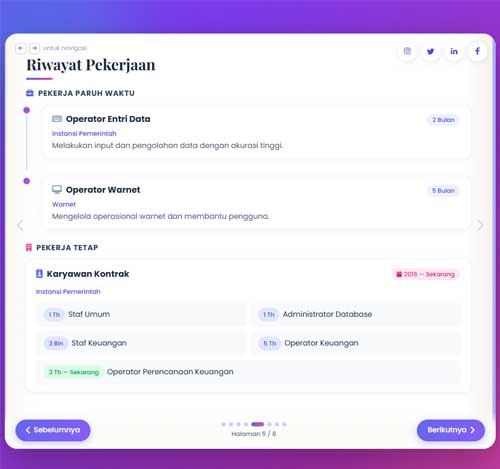

  

<h1 align="center">Preview Portfolio</h1>

   

  
# Portofolio Dian Siswandi, S.Kom

Selamat datang di porttolio pribadi saya! Ini adalah web satu halaman yang menampilkan informasi tentang diri saya, pengalaman, dan karya-karya saya.

## Deskripsi Proyek

Website ini dibuat menggunakan kombinasi HTML, CSS, JavaScript dan Bootstrap 5. Halaman ini mencakup:
- Data pribadi
- Deskripsi singkat tentang saya
- Akun media sosial
- Galeri dengan carousel untuk menampilkan gambar

### Fitur

- **Responsif**: Website ini dirancang agar dapat diakses dengan baik di semua perangkat (desktop, tablet, dan mobile).
- **Carousel Gambar**: Menampilkan dua gambar dalam format carousel.
- **Foto Profil**: Menampilkan foto profil bulat dengan ukuran 250x250.

#### Link Website
> Website `https://diansiswandi.github.io/`

#### Terakhir Update
- `Tanggal 07-Oktober-2026 Pukul 15:48 Wib`

#### Perubahan utama:
- Tailwind CSS + animasi modern (gradient bergerak, fade-in, skill bar)
- Navigasi TAMPIL di semua perangkat termasuk HP layar kecil
- Konten tidak terpotong (padding bawah + scroll)
- SEO meta tags + Open Graph ditambahkan
- Skill bar animasi (6 skill teknis)
- 3 card project (ganti placeholder placehold.co)
- Form kontak (mailto)
- Konsep buku digital (book-flip) dipertahankan
